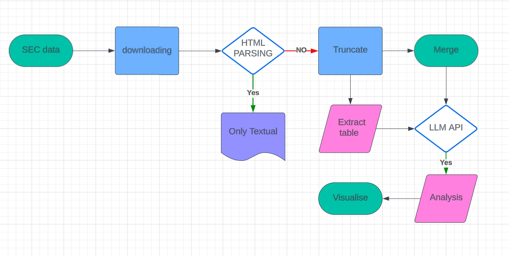

# StockAnalysisAI

#### StockAnalysisAI: Empowering Investment Decisions

StockAnalysisAI is a powerful tool designed to automate the analysis of financial documents and visualize stock performance trends. This platform leverages advanced NLP technologies to analyze SEC 10-K filings, providing investors with actionable insights and in-depth stock analysis.





#### Automated SEC Filings Analysis

Our application automates the extraction and analysis of SEC 10-K filings from public firms, making it easier for investors to get the information they need without manual effort.

### Key Features

##### Data Download:

Automatically download SEC 10-K filings for selected companies across multiple years using the sec-edgar-downloader package. This feature simplifies the process of obtaining necessary filings for analysis.

Each entity’s current filing history is available at the following URL:

https://data.sec.gov/submissions/CIK##########.json

Where the ########## is the entity’s 10-digit Central Index Key (CIK), including leading zeros.

#### Text Analysis:

Perform advanced text analysis on the downloaded SEC filings. Using the latest LLM APIs, our tool extracts meaningful insights that can influence investment decisions, such as trends in management discussion, risk factors, and more.

#### Visualization:

Generate compelling visualizations from the analyzed data to help users easily understand trends, compare metrics, and make informed investment decisions.

### Technology Stack

- **BeautifulSoup**: Used for parsing HTML documents. Chosen for its simplicity and ease of use, which is ideal for scraping web pages efficiently.

- **sec-edgar-downloader**: Automates the downloading of SEC filings. It provides a simpler, high-level interface compared to directly using the SEC EDGAR API, saving development time.

- **Arelle**: Handles XBRL and iXBRL financial data, essential for analyzing complex financial reports. It's open-source and supports extensive XBRL capabilities, making it superior for financial data tasks.

- **TextBlob**: Simplifies text processing tasks such as sentiment analysis and part-of-speech tagging. Offers a straightforward API, making it accessible and easy to integrate for NLP tasks.

- **Pandas**: A powerful library for data manipulation and analysis. It's preferred for its rich data structures and functions that are specifically designed for handling structured data efficiently.

- **Matplotlib/Seaborn**: Used for creating a wide range of static and interactive visualizations. Matplotlib provides the foundation for detailed customizations, while Seaborn adds attractive and informative statistical graphics capabilities.

These tools were selected to provide a robust framework for your project, ensuring efficiency and effectiveness in data processing, analysis, and visualization.


```bash
git clone https://github.com/YourGitHubUsername/StockAnalysisAI.git

```
---

### Credits

This project was developed by Gargi Chandrakar, leveraging advanced technologies to simplify and enhance the analysis of financial data. For further inquiries or contributions, please contact gargi_2001ee89@iitp.ac.in

---

Ⓒ 2024 Gargi Chandrakar. All Rights Reserved.
