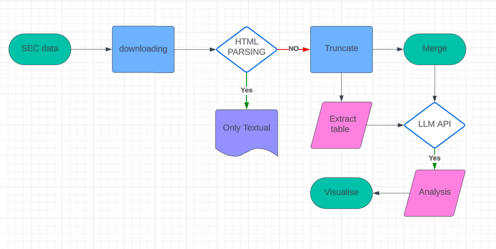
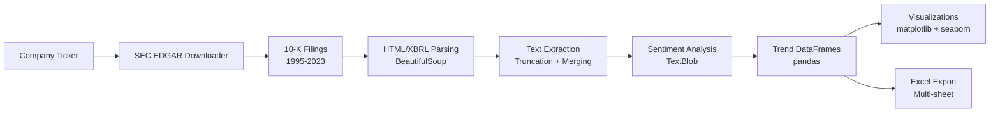

# Stock Analysis

Automated SEC 10-K filing analysis pipeline that downloads, parses, and performs NLP-driven sentiment analysis on financial documents with interactive visualizations.



## Overview

StockAnalysisAI automates the extraction and analysis of SEC 10-K filings from publicly traded companies. The pipeline downloads filings via the SEC EDGAR API, parses HTML/XBRL content with BeautifulSoup, performs sentiment analysis on management discussion and risk factor sections, and generates trend visualizations across multiple filing years.


```mermaid
graph LR
    A[Company Ticker] --> B[SEC EDGAR Downloader]
    B --> C[10-K Filings<br/>1995-2023]
    C --> D[HTML/XBRL Parsing<br/>BeautifulSoup]
    D --> E[Text Extraction<br/>Truncation + Merging]
    E --> F[Sentiment Analysis<br/>TextBlob]
    F --> G[Trend DataFrames<br/>pandas]
    G --> H[Visualizations<br/>matplotlib + seaborn]
    G --> I[Excel Export<br/>Multi-sheet]
```

## Features

- **Automated filing download**: Batch download 10-K filings for any public company using `sec-edgar-downloader`
- **HTML/XBRL parsing**: Extracts clean text from complex filing formats using BeautifulSoup and Arelle
- **Sentiment analysis**: TextBlob-based polarity and subjectivity scoring on filing sections
- **Multi-year trend analysis**: Visualize sentiment shifts across decades of filings
- **Table extraction**: Parses embedded financial tables from Excel exports
- **Iterative development**: Three notebook versions (V0 -> V1 -> V2) with progressive improvements

## Quick Start

```bash
git clone https://github.com/Akasxh/Stock_Analysis.git
cd Stock_Analysis
pip install -r requirements.txt

# Run the latest analysis notebook
jupyter notebook version/edgar_2.ipynb
```

## Project Structure

```
Stock_Analysis/
├── version/
│   ├── edgar_0.ipynb    # V0: Initial prototype
│   ├── edgar_1.ipynb    # V1: Improved parsing
│   └── edgar_2.ipynb    # V2: Full pipeline with visualizations
├── requirements.txt     # Dependencies
├── image.png            # Pipeline flowchart
└── README.md
```

## Tech Stack

- **Data Acquisition**: sec-edgar-downloader, SEC EDGAR API
- **Parsing**: BeautifulSoup, Arelle (XBRL)
- **NLP**: TextBlob (sentiment analysis)
- **Data**: pandas, openpyxl
- **Visualization**: matplotlib, seaborn, Streamlit
